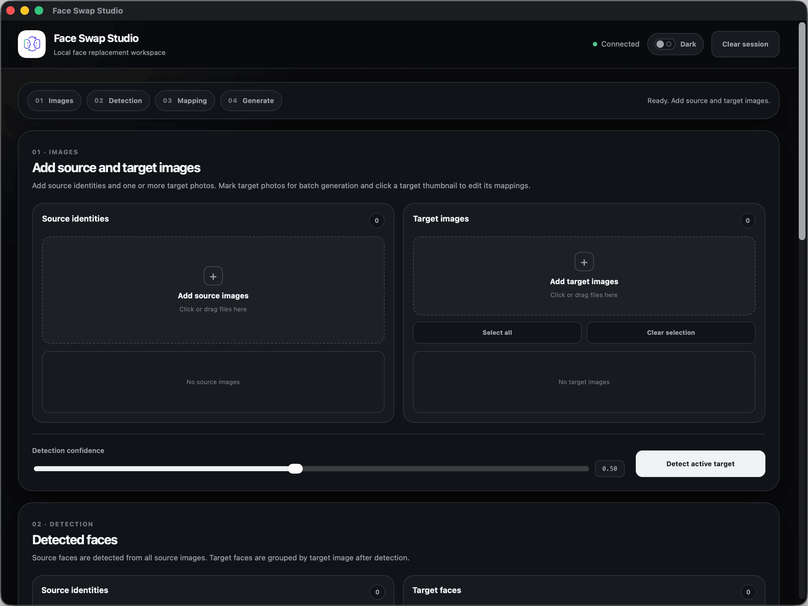
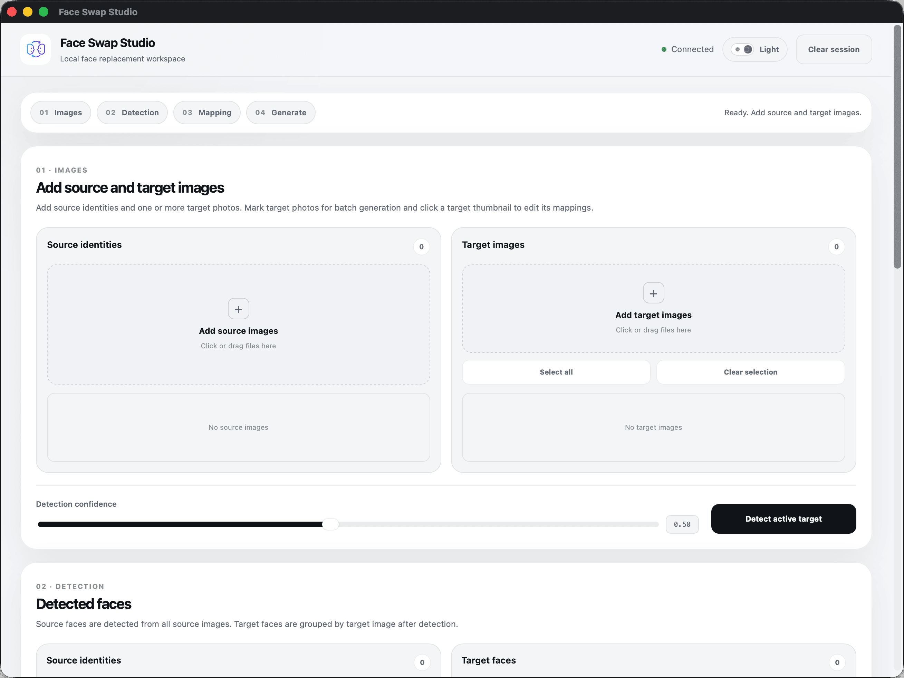
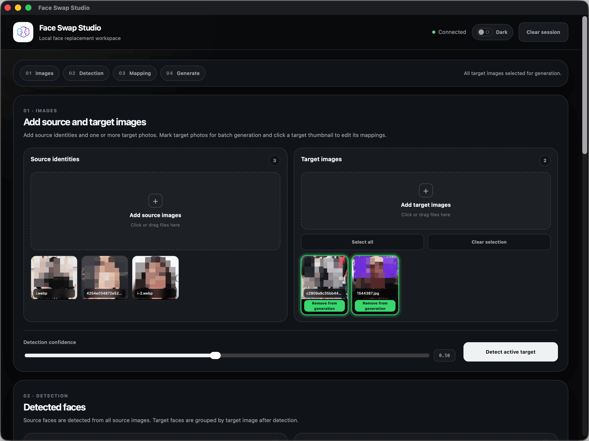
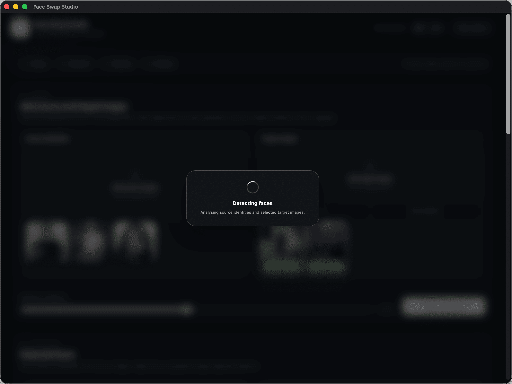
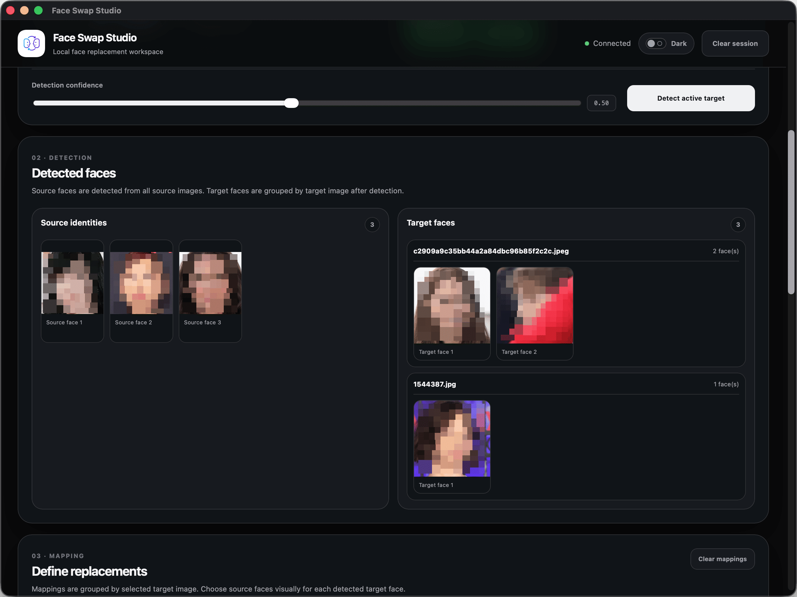
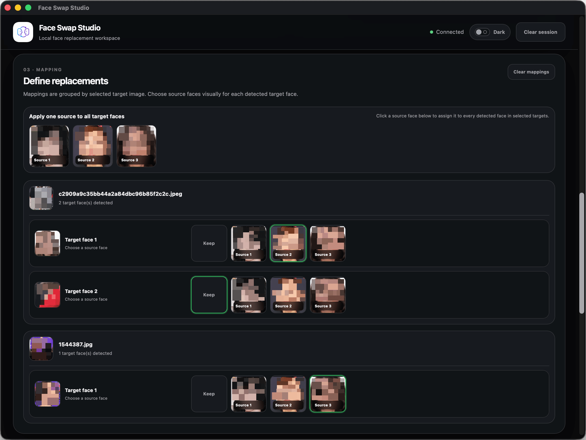
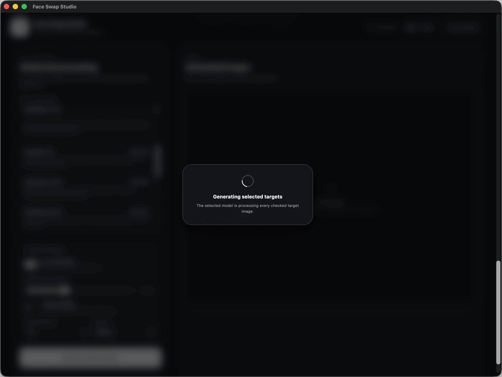
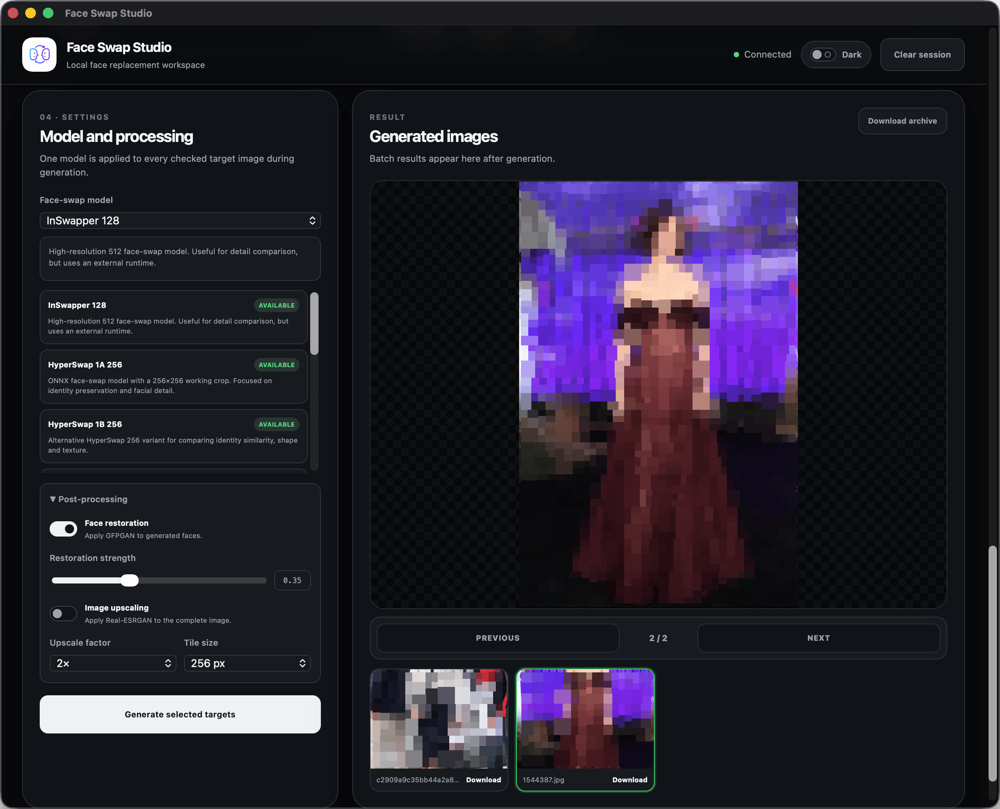

# Face Swap Studio

Face Swap Studio is a macOS application for testing and comparing several face-swap models in one local interface.

The project combines multiple external neural-network models, a face-detection pipeline, optional post-processing tools, batch target selection, per-image face mapping, result preview, and local result export into a single desktop-style workflow.

The neural-network models used by this project were not created or trained by this project. Face Swap Studio provides the application layer, macOS-oriented integration, model adapters, Apple Silicon runtime configuration, user interface, session handling, and local generation workflow around those external models.

The application runs locally on macOS. Uploaded images, detected face crops, intermediate files, generated previews, and temporary archives are stored in a temporary session directory and are deleted when the application shuts down. The application also performs an additional cleanup check on startup to remove temporary session data left from previous runs.

Downloaded results are saved separately to the user's `Downloads` folder and are not deleted automatically.

## Purpose and responsible use

Face Swap Studio is an academic, educational, and technical experimentation project.

It is intended for studying local AI image-processing workflows, model integration, UI design, macOS packaging, and Apple Silicon compatibility.

Use this project responsibly.

Do not use the application to create deceptive, harmful, illegal, non-consensual, abusive, or unethical content. Always respect privacy, consent, copyright, platform rules, local laws, and the dignity of other people.

All screenshots in this README use demonstration images with faces intentionally blurred or obscured because the people shown in the source images did not provide consent for public display in this repository.

## Included model integrations

Face Swap Studio can expose several configured face-swap and enhancement backends when the corresponding model files are present.

Face-swap models:

- InSwapper 128;
- HyperSwap 1A 256;
- HyperSwap 1B 256;
- UniFace 256;
- SimSwap 512 beta;
- Ghost U-Net 1 block;
- Ghost U-Net 2 blocks;
- Ghost U-Net 3 blocks;
- Ghost 2.0 head swap.

Post-processing tools:

- GFPGAN face restoration;
- Real-ESRGAN image upscaling.

The project does not claim authorship of these neural-network models. They are integrated as external model backends. Their own licenses, usage terms, model cards, and restrictions should be respected separately.

## How it works

Face Swap Studio starts a local backend server and opens a dedicated macOS application window.

The user adds one or more source identity images and one or more target images. The application detects faces, groups detected target faces by target image, allows the user to define replacements visually, runs the selected face-swap model, optionally applies post-processing, and displays generated results.

Processing flow:

    Source identity images
              ↓
       Source face detection
              ↓
    Target image selection
              ↓
       Target face detection
              ↓
    Visual source-to-target mapping
              ↓
       Selected face-swap model
              ↓
    Optional restoration and upscaling
              ↓
    Generated previews and Downloads export

The application supports both single-image and multi-image generation.

Several target images can be selected at once. Every selected target can have its own detected faces and its own replacement mappings.

## Installation from GitHub Release

A full macOS application bundle can be distributed through GitHub Releases.

Because the packaged application may be very large, the release archive can be split into several parts.

Download all parts from the latest GitHub Release into the same folder.

Example release assets:

    Face Swap Studio.zip.part-aa
    Face Swap Studio.zip.part-ab
    Face Swap Studio.zip.part-ac
    ...
    Face Swap Studio.zip.sha256

After downloading all parts, combine them on the Mac:

    cat "Face Swap Studio.zip.part-"* > "Face Swap Studio.zip"

If a checksum file is provided, verify the archive:

    shasum -a 256 -c "Face Swap Studio.zip.sha256"

Extract the archive:

    unzip "Face Swap Studio.zip"

Move the application to `Applications` if desired:

    mv "Face Swap Studio.app" /Applications/

On the first launch, macOS may display a warning because the application is not signed or notarized. In that case, right-click the application and select `Open`.

If macOS quarantine prevents launch, remove the quarantine attribute:

    xattr -cr "Face Swap Studio.app"

or, after moving it to Applications:

    xattr -cr "/Applications/Face Swap Studio.app"

## Python requirement for the packaged application

The packaged application includes the project and its virtual environment, but the virtual environment may point to a Homebrew Python installation.

The development environment uses Python 3.11 through Homebrew:

    .venv/bin/python -> python3.11
    .venv/bin/python3.11 -> /opt/homebrew/opt/python@3.11/bin/python3.11

On another Apple Silicon Mac, install Python 3.11 with Homebrew before launching the application:

    brew install python@3.11

Check that the expected Python executable exists:

    ls -l /opt/homebrew/opt/python@3.11/bin/python3.11

If the second Mac uses the same Apple Silicon architecture and has Python 3.11 installed in this location, the bundled virtual environment is expected to work in the same way as on the development machine.

## First launch

When Face Swap Studio opens, the main window shows the initial empty workspace.

The application has dark and light themes.

The top area contains:

- backend connection status;
- theme switcher;
- session reset button.

When the status says `Connected`, the backend is running correctly and the application is ready to use.

The theme toggle switches between dark and light mode.

The `Clear session` button removes the current session data from the UI and starts a new empty session. It clears uploaded images, detected faces, mappings, generated previews, and temporary result files for the active session.

## Step 1. Add source identities and target images

The first section contains two upload areas:

- `Source identities` — faces that will be used as replacement identities;
- `Target images` — images where faces will be replaced.

Several images can be uploaded at once. More images can also be added later.

All uploaded source identity images are used for face detection. Source images do not need to be selected or highlighted.

Target images can be included or excluded from generation.

A target image highlighted in green is selected for generation. A target image that is not highlighted will not be processed.

Target selection controls:

- `Select all` — include all uploaded target images in generation;
- `Clear selection` — remove all target images from generation selection;
- `Add for generation` — include an individual target image;
- `Remove from generation` — exclude an individual target image.

If no target image is manually selected, the workflow can still fall back to the active target image where applicable.

Every uploaded thumbnail can be opened in a larger preview by clicking it.

Unwanted uploaded images can be removed by hovering over the thumbnail and pressing the `×` button in the upper-right corner. This is useful when an image was added accidentally.

## Step 2. Detect faces

After source and target images are added, run face detection.

The detection section contains the `Detection confidence` setting and the `Detect active target` action.

The confidence value controls how strict face detection should be. Higher values can reduce false detections, while lower values can detect more faces in difficult images.

During processing, Face Swap Studio displays a loading screen.

The detection step analyzes source identities and selected target images.

## Step 3. Review detected faces

The `Detected faces` section is primarily informational.

It shows all detected source faces on the left and detected target faces on the right.

Source faces are displayed as a continuous list.

Target faces are grouped by target image. This makes it clear which faces were detected in each target file.

Every detected face thumbnail can be clicked to open a larger preview.

This section helps verify that the detector found the expected faces before replacement mappings are defined.

## Step 4. Define replacements

The `Define replacements` section is where source faces are assigned to target faces.

At the top of the section there is a quick source-face strip.

Clicking one source face in this strip applies that source face to every detected target face in the selected targets. This is useful when the same identity should replace all target faces.

Below the quick assignment strip, Face Swap Studio displays replacement groups for each target image.

Each target image has its own mapping block. Inside the block, every detected target face can be assigned to:

- `Keep` — leave this target face unchanged;
- one of the detected source faces — replace this target face with the selected identity.

The mapping interface is visual. It uses face thumbnails instead of relying only on numbers or text labels.

Every face thumbnail can be clicked to view it larger.

This makes it easier to define different replacements for different target images and different faces inside the same target image.

## Step 5. Select model and post-processing options

The generation settings section contains the model selector and optional post-processing controls.

A face-swap model must be selected from the dropdown list.

Below the selector, the application displays short descriptions of available models.

A green `Available` label means that the corresponding model is present, configured correctly, and ready to run.

The post-processing panel can be expanded to configure optional improvements.

Available post-processing options:

- face restoration with configurable restoration strength;
- image upscaling with configurable upscale factor;
- tile size for upscaling.

Post-processing is disabled by default.

After selecting the model and desired options, press `Generate selected targets`.

During generation, the application displays a loading screen.

## Step 6. Preview and download generated images

After generation is complete, results appear in the `Generated images` section.

The large preview area shows the currently active generated result.

If several target images were generated, the preview controls below the large image can be used to move between results:

- `Previous`;
- `Next`.

Below the large preview, all generated results are displayed as smaller cards.

Clicking a result card selects that result.

Clicking the large preview or a result thumbnail opens the image in a larger modal preview.

Every result card has its own `Download` button. This downloads only that specific generated image to the `Downloads` folder.

The top result action button changes depending on the number of generated files:

- `Download active` — shown when there is one generated result;
- `Download archive` — shown when there are several generated results.

`Download archive` creates and downloads a zip archive containing the currently available generated results.

If a generated image should not be included in the archive, hover over its result card and press the `×` button. Removed result cards are deleted from the current session and are not included in the archive.

## Temporary data and privacy behavior

Face Swap Studio stores temporary working data in the system temporary directory.

Temporary session data includes:

- uploaded source images;
- uploaded target images;
- detected face crops;
- target analysis data;
- intermediate working images;
- generated preview images;
- temporary zip archives created for download.

This data is deleted when the backend shuts down normally.

The application also performs an additional cleanup on startup. This removes temporary session data left from previous runs if the application or backend was closed unexpectedly.

Files downloaded by the user are not temporary session files. Downloaded images and archives are saved to the `Downloads` folder and remain there until the user deletes them manually.

## Local development

The project can also be run from source.

Create or activate the virtual environment, then run:

    ./scripts/run.sh

The script activates `.venv`, sets the required environment variables, and starts `app.py`.

The application backend runs on:

    http://127.0.0.1:7860

Environment variables used by the launcher include:

    PYTHONUNBUFFERED=1
    PYTHONPATH=<project-root>
    PYTORCH_ENABLE_MPS_FALLBACK=1
    TOKENIZERS_PARALLELISM=false

The macOS application wrapper uses the same backend entry point but opens the UI in a dedicated application window.

## Project structure

    Face-Swap-Studio/
    ├── app.py
    │   └── Main backend entry point
    ├── assets/
    │   ├── icons/
    │   │   └── Application icon
    │   └── forreadme/
    │       └── README logo and screenshots
    ├── config/
    │   └── Runtime configuration
    ├── data/
    │   ├── input/
    │   ├── output/
    │   └── temp/
    ├── models/
    │   ├── detectors/
    │   ├── enhancers/
    │   ├── swappers/
    │   └── upscalers/
    ├── scripts/
    │   ├── environment checks
    │   ├── model download and verification scripts
    │   ├── external model runner scripts
    │   ├── launch scripts
    │   └── macOS application packaging scripts
    ├── src/face_swap_studio/
    │   ├── adapters/
    │   │   └── Model adapter implementations
    │   ├── core/
    │   │   └── Detection, swapping, masking, enhancement, and upscaling pipeline
    │   ├── domain/
    │   │   └── Core entities and processing options
    │   ├── models/
    │   │   └── Model manifest and model manager
    │   ├── services/
    │   │   └── Batch and image services
    │   ├── ui/
    │   │   ├── FastAPI server
    │   │   ├── session storage
    │   │   └── static HTML, CSS, and JavaScript UI
    │   └── utils/
    │       └── Logging and path utilities
    └── tests/
        └── Adapter, detector, and pipeline tests

## Building the macOS application bundle

The local macOS application bundle can be built with:

    ./scripts/build_macos_app.sh

The generated application appears in:

    dist/Face Swap Studio.app

Create a zip archive for transfer:

    ditto -c -k --sequesterRsrc --keepParent "dist/Face Swap Studio.app" "dist/Face Swap Studio.zip"

For GitHub Release distribution, split a large archive into smaller parts:

    cd dist
    split -b 1900m "Face Swap Studio.zip" "Face Swap Studio.zip.part-"

Create a checksum:

    shasum -a 256 "Face Swap Studio.zip" > "Face Swap Studio.zip.sha256"

## Development and testing environment

Primary development and testing environment:

    MacBook Air with Apple Silicon
    macOS
    Homebrew Python 3.11

Python path used during development:

    /opt/homebrew/opt/python@3.11/bin/python3.11

The application is configured for local Apple Silicon execution and uses macOS-friendly runtime settings where required.

## Notes

Face Swap Studio is a local application wrapper and workflow environment for multiple external face-swap models.

The project focuses on:

- application integration;
- local macOS usability;
- Apple Silicon compatibility;
- multi-model experimentation;
- visual batch workflow;
- temporary session isolation;
- convenient local export of generated results.

The project does not train or claim ownership of the integrated neural-network models.